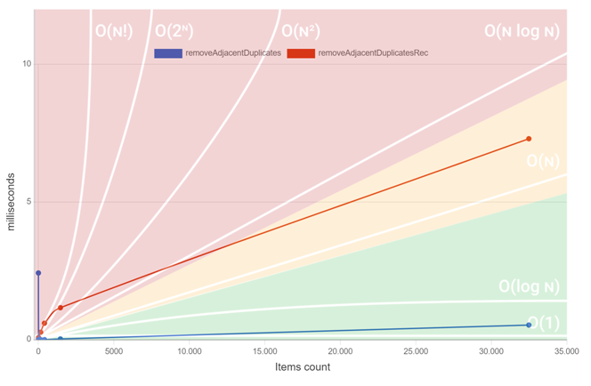

# Algoritmia: Ejercicio 1


## Instalación y ejecución

* Clona el repo
* instala las dependencias, ejecutando: ```npm install```
* Ejecuta mediante el comando: ```npm run start```. Para ver la salida, abrir el navegador a la URL: http://localhost:3000


## Ejercicio

Se precisa crear un algoritmo llamado `removeAdjacentDuplicates`, con la siguiente firma: `(nums: Array<number>) => Array<number>`.

Este algoritmo tiene que, a partir de un array de números de entrada, eliminar los duplicados consecutivos, veamos algunos ejemplos: 
* [1,2,2,3,4,4,4] => [1,2,3,4]
* [1, 1, 0, 0, 1, 0, 1, 1, 0] => [1, 0, 1, 0, 1, 0]

### Pistas

Se puede implementar cualquier solución: iterativa, recursiva..., pero eso determinará el rendimiento del mismo.

### Testing

Hay un fichero de testing que tiene utilidades para si queréis comprobar algo, aunque tal y como os dejo el proyecto, si abrís la consola veréis que se ejecuta una suite de tests y el gráfico mostrará el resultado de vuestro algoritmo. 

La superposición de la imagen con el gráfico nos permite comparar el orden. 

El gráfico, a veces da formas raras, es por la librería, que no es de las mejores :)


Mi solución, en la miagen a continuación, muestra dos aproximaciones, una iterativa y otra recursiva: 



Suerte!!

# Gráfico del algoritmo